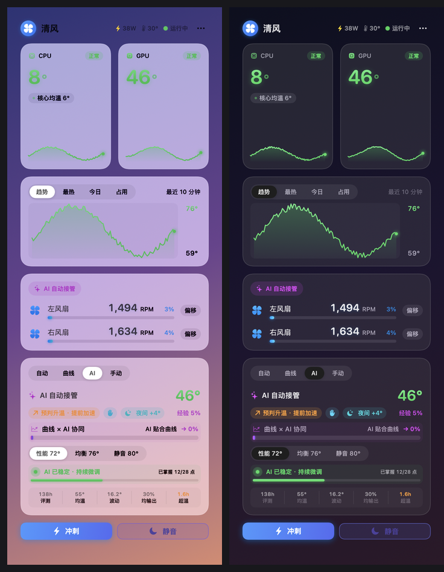

# FanCtl(清风)— macOS 风扇智能管理

> **清风**是一款 macOS 菜单栏风扇控制工具：四种调速模式（系统自动 / 温度曲线 / AI 自适应 / 手动），
> 多层安全红线（高温兜底、SSD/电池托底）永远压过用户意图，本地自适应学习你的机器散热特性，
> 无需配置、完全离线、卸载即还原。**English TL;DR:** a native macOS menu-bar fan controller with
> four modes (system / curve / adaptive-AI / manual), hard safety overrides (92°C failsafe, SSD &
> battery guards) above user intent, and fully local adaptive learning. macOS 26+ (Apple Silicon
> only), Swift 5.9, zero third-party dependencies.




**版本**：以 [Releases](https://github.com/yuting-ou/FanCtl/releases) 与仓库根 `VERSION` 文件为准（单一来源） · **断言数**：见上方 tests 徽章（CI 每次推送自动更新，正文不再硬编码） · **语言**：Swift 5.9 · **平台**：macOS 26+（**仅 Apple Silicon**——macOS 26 已放弃 Intel；控制逻辑本身不依赖新系统，欢迎 fork 做 UI 降级移植）

> 本文档后半部分（§7 起）面向 **AI 助手/开发者**：读完即可理解本项目架构、控制逻辑、安全机制与开发流程。普通用户只需读下面的「快速安装」。

## 快速安装（用户看这里）

```bash
# 1) 下载 Release 附件并解压（Releases 页 → FanCtl-vX.Y.Z.zip），cd 进解压目录
#    或自行源码构建：git clone 后 ./scripts/build.sh
# 2) 安装（需密码：daemon 装入系统目录 + 菜单栏 App 装入 /Applications）
sudo ./install.sh
# 3) 菜单栏出现「清风」图标即完成；建议在面板菜单里打开「登录时启动」

# 卸载（完全卸载：登录项 / daemon / App / 数据 / 日志一并清理）
sudo ./uninstall.sh
```

---

## 1. 项目是什么

「清风」是 macOS 的风扇控制工具,核心能力:

- **四种调速模式**:`auto`(交还系统调度)/ `curve`(温度曲线)/ `ai`(目标温度 + 趋势/功耗前馈的自适应预测控制，含在线热参数辨识)/ `manual`(手动固定)
- **多层安全红线**:高温兜底(92°C 全速)、SSD 托底(70°→60%、78°→100%)、电池托底(45°→60%、48°→100%)、传感器卡死/偏低失真门控、看门狗——优先级永远高于用户意图
- **体感补偿**:掌托超过 40°C 时自动收紧目标（可选），直接服务"烫不烫手"而非代理指标
- **自适应学习**:记录"这台机器稳住每个温度需要多少风量"(查表)+ 在线辨识散热参数(RLS 线性模型)；**81 成员参数化热模型族扫描**保证标定在整族硬件上稳健
- **可验证**:2500+ 项纯逻辑断言（含 81 成员参数化 HIL 闭环扫描），CI 每次推送自动回归——准确数字见顶部 tests 徽章
- **可解释性**:status.json 携带"当前转速由谁决定"(reason)与 AI 实时意图,UI 直接展示

> **关于"AI"命名**:AI 模式的实质是**自适应控制**——增量式 PD + 功耗前馈 + 在线热参数辨识(RLS 回归 + 非参数查表),不是神经网络,不做模型训练,完全本地运行。命名取其"自适应、免配置"的用户语义。

## 2. 架构总览(双进程 + JSON 文件通信)

> 🗺️ **[docs/architecture.md](docs/architecture.md)** — 一页架构地图：数据流、决策优先级、两套学习机制分工、安全红线清单、调参前检查单。

```
┌─────────────────────┐   写 config.json    ┌──────────────────────┐
│  FanCtlApp (菜单栏)  │ ──────────────────▶ │  fanctld (LaunchDaemon)│
│  无特权,不直连 SMC   │   (用户意图)        │  root,唯一 SMC 写者   │
│                     │ ◀────────────────── │  自适应循环 1~20s     │
│  展示/告警/通知      │   读 status.json    │                      │
└─────────────────────┘   (实时状态)        └──────────────────────┘
```

- **为什么用文件而非 XPC**:通信频率极低(status 10s 心跳、config 事件驱动),JSON 可审计、可脚本化、崩溃隔离;该决策经过评审,维持不变。
- **App 不直连 SMC**:所有温度/风扇/功耗由 daemon 采集写入 status.json,避免资源竞争。
- **文件位置**:`/Library/Application Support/FanCtl/`(v2.8 起root:admin 775——App 修改配置需以管理员账户安装运行)、`/Library/Logs/FanCtl/`。

### 关键文件

| 文件 | 内容 |
|---|---|
| `config.json` | 用户意图:mode、曲线、偏移、冲刺/静音截止、AI 目标、环境补偿/夜间档开关 |
| `status.json` | daemon 每拍写出:全部传感器、appliedPercent(s)、fans、reason、aiIntent、learning 状态、功耗、环境温度、故障标志 |
| `stats.json` / `history.json` | 今日战报(温度直方图/功耗累计,跨天归档,保留 30 天) |
| `ai-learn.json` | 热经验查表(2°C 桶 × 场景桶) |
| `thermal-model.json` | 散热参数线性模型(a=热阻,b=风量效率) |
| `ai-metrics.json` | AI 控制质量评测(均温/波动/超温) |
| `reset-learn.flag` | App 写此文件请求清空学习数据,daemon 检测后重置 |

## 3. 源码结构

```
Package.swift           5 个 target(无第三方依赖)
Sources/
├── SMCCore/            核心库(纯逻辑,无 UI,可测试)
│   ├── SMC.swift           AppleSMC IOKit 通信层(SMCIO 协议抽象,测试用 MockSMC 注入)
│   ├── Fans.swift          FanController(读写/强制/交还) + TemperatureSensors(热点追踪/分类) + 健康检测
│   ├── Config.swift        数据模型:FanConfig/CurvePreset/DaemonStatus/DailyStats/ControlReason + ConfigStore 持久化
│   ├── FanControlLaw.swift 平滑(升快降慢 EMA + 坏读剔除) + shape/slew(升降速限速 + 死区)
│   ├── FanPipeline.swift   决策管线:基础模式 < 静音封顶 < SSD 托底 < 高温兜底(纯函数)
│   ├── FanAIController.swift  AI 增量式 PD 控制器(目标温度 + 趋势/功耗双通路前馈 + 空闲交还/夺回 + 曲线锚定)
│   ├── ThermalLearn.swift  热经验查表(2°C 桶 EMA,场景桶,时间衰减,污染清洗)
│   ├── ThermalModel.swift  散热参数辨识(在线梯度下降拟合 温度=环境+a·功耗−b·风量)
│   ├── CurveOptimizer.swift  AI 曲线优化(温度分布分位数 → 个性化三档曲线)
│   └── StatsSampler.swift  每日统计采样(跨天归档)
├── fanctld/main.swift   root 守护进程:自适应主循环、文件监控、睡眠/唤醒、故障恢复
├── FanCtlApp/           SwiftUI 菜单栏 App(面板/曲线编辑器/通知)
├── fanprobe/main.swift  只读诊断工具(无需 root)
└── fanctltests/main.swift  纯逻辑测试(自带断言 harness,2500+)
scripts/                 build.sh / install.sh / deploy.sh / uninstall.sh
dist/                    构建产物(FanCtl.app + fanctld)
```

## 4. 控制逻辑(核心)

### 4.1 决策管线优先级(低 → 高)

```
基础模式(auto/curve/ai/manual/电池档/夜间档) < 静音封顶(会议) < SSD 托底 < 高温兜底
```

- `FanPipeline.decide` 是**纯函数**(daemon 与测试共用同一份代码,无镜像漂移),输入含历史状态(wasSSDGuardActive 等)实现滞回。
- **静音承诺**(会议模式):`quietUntil` 截止前输出压到 `quietCapPercent`(30%),但安全红线永远压过它。
- **SSD 托底**:≥70°C→60%、≥78°C→100%(危急档是硬件红线,手动模式也不豁免),释放带滞回(67°/75°)。
- **高温兜底**:raw 温度 ≥92°C→100%(用原始读数,不经平滑,毛刺不漏报),释放 88°C。auto 模式豁免(风扇本就归系统)。
- **v2.6 修复**:风扇独立偏移在安全事件时**旁路**(兜底 100% 不再被 -20% 偏移削成 80%);兜底同时清除电池/夜间覆盖标记。

### 4.2 控制手感(两段式)

1. **平滑层** `smooth()`:骤降 >30°C 判坏读(最多连续沿用 3 拍);升快降慢 EMA(α 0.35/0.2);负载明显结束后加速回落(α 0.45)。
2. **输出层** `shape()`(曲线)/ `slew()`(AI):升速限 8%/拍、降速限 6%/拍、±5% 死区(曲线模式);`force=true`(安全事件)跳过限速瞬时全速。AI 模式不用死区(避免吞噬 PD 微调)。

### 4.3 AI 控制器(增量式速度型 PD)

- `output += kP·error·dt_nom + kD·slope·(1/dt_nom)`,clamp [0,100];dt 以 3s 为标称拍归一化(自适应间隔下语义恒定)。
- **斜率死区** ±0.15°C/s(滤传感器噪声被微分放大)、**舒适温区** ±2°C(防积分漂移)、**anti-windup**(饱和跳过同向 P 项)。
- **功耗前馈双通路**:EMA 慢速通路(渐变负载)+ raw 快速通路(突增 onset)+ **v2.6 分项通路**(powermetrics 采 CPU/GPU 各自功耗,阈值 8W,GPU 突增也能提前介入)。三路 max 合并不叠加。
- **空闲交还/夺回**:持续低温(目标−8° 深凉 30s/常规 120s)且输出低位 → 交还系统调度(风扇可停转);温度 ≥ 目标连续 2 拍或斜率骤增 → 夺回。60s 宽限防停转瞬态误夺回、10 分钟振荡冷却。
- **曲线锚定**(v9 探测式):稳态时输出向用户曲线收敛——每 25s 迈 ≤1.5% 小步,|error| ≥ 舒适带−1° 即停步;动态时温度主导——调曲线=调 AI 期望转速。
- **v2.6 环境补偿**:AI 目标 += clamp((环境−25)×0.5, −5, +8),夜间档再 +4°。

### 4.4 学习系统(两套互补)

| 机制 | 数据 | 用途 |
|---|---|---|
| 热经验查表 `ThermalLearn` | 稳态 (温度, 风量) 按 2°C 桶 × 电源/功耗场景桶 | 升温前馈/夺回种子;含 14 天时间衰减与污染清洗 |
| 参数模型 `ThermalModel` | 稳态 (环境, 功耗, 风量, 温度) | 线性拟合热阻 a 与风量效率 b,可外推;成熟(≥30 样本)后预测"压到目标所需风量",与查表取较大者 |

- **采样纪律**(daemon 把关):只记稳态拍(温度 <0.35°/拍、baseTarget≈shapedBase、非饱和),排除手动模式/安全覆盖/限速过渡态。
- AI 目标温度变化时重置学习数据(需求随目标漂移)。

## 5. 安全设计(daemon)

- **退出/睡眠**:恢复系统自动调度(SIGTERM/睡眠回调);**启动时无条件清理 SMC 强制模式残留**(崩溃/断电重启后风扇不被钉死)。
- **传感器故障**:连续 5 拍读失败 → 交还系统并写 controlFault 到 status;启动即故障也会写最小状态。
- **写入闭环可观测**:`WriteHealth`(连续写失败 5 拍 fault)+ `FanFeedbackHealth`(实际 RPM 不跟随目标;v2.6 加升速宽限与故障锁存——连续 3 拍匹配才解除,消除"交还→夺回"振荡)。故障期间每 30s 试探接管一次(写-验证-交还协议,严格 3 拍验证窗)。
- **数值防御**:全链路 NaN/Inf 防护(SMC 读数、曲线插值、配置 sanitize、App 端 Int 转换);SMC 键值钳位防 Int()/UInt16() trap。
- **配置损坏自愈**:loadConfig 失败备份坏文件并回写默认。
- **冲刺超时兜底**:`boostUntil` 过期后 manual 100% 不再无限持续(App 崩溃场景)。

## 6. 构建 / 测试 / 部署

```bash
# 测试(无需 Xcode,2500+ 断言,失败退出码非 0)
swift run -c release --disable-sandbox fanctltests

# 构建(先跑测试再组装 dist;版本号单一来源 = 根目录 VERSION 文件)
./scripts/build.sh

# 安装(需 sudo:daemon → /usr/local/libexec + LaunchDaemon;App → /Applications/清风.app)
sudo ./scripts/install.sh

# 仅更新 App(免密)
./scripts/deploy.sh

# 卸载
sudo /Applications/清风.app/Contents/Resources/uninstall.sh

# 诊断(只读)
swift run -c release --disable-sandbox fanprobe
```

日志:`/Library/Logs/FanCtl/fanctld.log`(512KB 轮转)。UI 快照验证:`FanCtlApp --snapshot [curve|auto|manual|hotspots|today|custom] [dark]` 渲染 PNG 到 /tmp。

## 7. 给 AI 助手的注意事项

1. **改逻辑前必读对应文件头注释**:核心模块顶部有详细的物理依据与线上调试经验(振荡/漂移/污染的踩坑史)。
2. **改 SMCCore 后必须跑 `fanctltests`**:测试与 daemon 共用同一份决策代码,2500+ 断言覆盖管线优先级、控制律、学习、AI 状态机、Codable 兼容（徽章为准）。
3. **向后兼容是硬约束**:config/status/stats/learn 各 JSON 都有自定义 Codable 处理旧数据缺字段;新增字段时,非 Optional 字段必须 decodeIfPresent + 默认值。
4. **时间语义**:自适应循环间隔 1~20s,所有"每拍"参数(限速、学习阈值)按 3s 标称拍标定;按秒的计时(idle 交还等)用秒。改任何"每拍"参数要考虑间隔漂移。
5. **安全红线不可让**:92°C 兜底 / SSD 78°C 危急 / 传感器故障交还,任何新功能不得压低或绕过;静音/夜间/电池档都是"在红线之上的覆盖"。
6. **防御 NaN/Inf**:传感器读数和外部 JSON 都可能携带坏值;Double→Int 转换必须钳位(isFinite 检查),本项目对 NaN 穿透 min/max 有多次踩坑记录。
7. **UI 与 daemon 的单一数据源**:App 展示一律读 status.json(daemon 决策),不得在 App 侧重算控制语义。
8. **fd 生命周期**:文件监控(DispatchSource)重建时 fd 只由 cancelHandler 关闭,严禁 eager close 后 open(会复用 fd 号误关新 watch)。
9. **测试基建**:`fanctltests` 里 `VirtualMachine` 是一阶热模型,可闭环验证控制器(防极限环/过冲);新增控制参数建议先用它仿真。

## 8. v3.6.1 变更摘要(2026-09,对抗式审查稳定版)

四路并行对抗式审查(控制核心/硬件IO+守护进程/App/测试与文档),38 项指控逐条核实后修复 25 项、按红线跳过 3 项(记录于 EVOLUTION.md):

- **P1 温变快速轮询复活**:`prevRawTemp` 在被读取前覆盖,tempChange 恒 0,"快速升温→1s 轮询"自 v2.6 起为死代码。修后负载突增(未达 80° 兜底)响应拍从 3-10s 缩到 1s。
- **P1 迟滞带 0/100 边界豁免**:AI 输出饱和时候选 100 被 4% 带宽钉死在 97%,"压不住"检测(saturated≥98)永不触发。0 侧同理(停转意图卡在 1-3%)。
- **P2 一组**:过冲峰值补齐 AI 模式/安全覆盖排除集;学习桶过期衰减双清(防"幽灵 0"把复学拉低 2/3)+衰减幂等;瞬时 SMC 故障不再清空传感器分类(唤醒窗口控制离线 5 分钟根因);SMC 全调用串行化(重扫队列与控制拍并发调同一 io_connect_t 属未定义行为);CI 断言提取步骤补 pipefail+锚定成功行(假绿复发);版本自检失败不再消费 24h 窗口(开机网络未就绪场景)。
- **P3 一组**:故障试探验证窗修正为完整 3 拍+恢复清残留计数;学习重置标志删除失败不再每拍重置;statusChangeSummary 补 NaN/Inf 防护(Int(NaN) 是 root 崩溃)并纳入掌托/散热片/体感补偿/包络健康度;learn/stats/history/ai-metrics 损坏备份+日志(此前静默清零);DailyStats.sanitized 消毒+avgTemp 分母下限(防手改 JSON 的 Int() trap);ps 采样移出协作线程池+4s 强杀(挂起会耗尽协作池);powermetrics SIGKILL 升级;Intel FS! fan id≥16 防御;si8/si16 有符号解码;install.sh 升级前停旧 App;uninstall.sh 补 pkill 兜底。
- **测试/文档**:断言 2570→**2603**。族扫描恢复接管拍数从恒 0 修正为真计量;补 81 成员网格完整性断言(此前网格被改小测试依旧全绿);删恒真死断言;README 曲线锚定描述 v7→v9、试探节奏 20 拍→30s、章节重排;architecture.md 过期断言数改徽章指针。

## 9. v3.6 变更摘要(2026-09,进化传播链 + 数据裁判)

- **版本自检**(方向一):App 启动 60s 后(此后每 24h)静默查询 GitHub Releases,
  新版本时菜单出现"⬆️ 新版本可用"(点击打开下载页,支持"跳过此版本")——
  此前的所有进化(扫描瘦身/学习门/竞态修复)只存在于仓库,已装用户无法感知。
  失败全静默,不自动安装(常驻不添乱)。`VersionCheck` 纯函数 10 项测试。
- **学习图包络健康仪表**(方向二·数据裁判):`status.json` 新增 `learnEnvelopeGap`
  (旧版无此字段为 nil,向后兼容)——高温段旧非单调数据(86°→74%/88°→62%)与
  单调包络的差值;fanprobe 可查。观察协议:2-3 周收敛 → 3B 闭环确认;
  不收敛 → 一次性数据修正(学习数据,不碰控制律)。
- 测试 2548 → 2570(版本比较 10 + 包络仪表 4 + Round1-3 契约 8)。

## 10. v3.4 变更摘要(2026-09,泛化鲁棒性 + 诚实化 + 可发现性)

- **参数化热模型族扫描**(测试,零行为变更):VirtualMachine 参数化为 81 成员族(env/R/τ/风扇权限 3⁴ 交叉),每成员跑四相位 AI 闭环(55W hold → 38W 轻载 20min → 75W spike → 38W)。**矩阵结论:现标定全族稳健**——轻载交还 ≤2 次(循环抑制+退避全族有效)、可达成员 hold 误差 ≤3.4°(门限 8°)、0 循环违例。失效边界不在控制律而在硬件物理:被动平衡 >96.5° 的成员(重 R 暖环境弱风扇)满权限仍 >100°,现实中 macOS 热节流兜底,AI"压不住"检测已正确覆盖。**阈值保持硬编码,不改估计驱动**(扫描证明裕度足够;估计误差回授控制的风险大于收益)。扫描固化为回归 `TestsFamily.swift`,调参前必跑。
- **防御机制带噪闭环验证**(B 项):噪声 ±0.3° + 丢读 + 风扇一阶滞后 + 真停转注入下——坏读剔除 0 误触发;反馈健康 1350 启查线语义锁定(热角停转必捕获/凉角停转无害不报警——命令 RPM 低到停转无害则不管);分项功耗不可用时控制器安全降级到整机前馈(显式闭环断言)。
- **命名诚实化**(C 项):README 加"AI = 自适应控制不是神经网络"边界声明;`FanAIController` 头注释加同名声明(类名不改保兼容)。
- **架构地图**(D 项):`docs/architecture.md` 一页索引——数据流/决策优先级/两套学习分工/安全红线清单/时间语义/调参前检查单。
- **powermetrics golden 样本测试**(E 项):macOS 26 真实格式 + 旧版格式 + 报错输出三份 fixture,锁定解析契约(多样本取最后/mW 换算/干扰行忽略/报错→nil→退回 PSTR);显式断言分项功耗不可用时闭环仍安全。
- 测试 2425 → 2499 断言(族扫描 + 防御闭环 + golden 解析)。

## 11. v3.3 变更摘要(2026-09,发散思考落地)

- **体感补偿**(发散结论"芯片温度是代理指标"的第一个落地):掌托超过 40°C(体感阈值)时目标自动收紧最多 4°C——直接服务用户感知的"烫不烫手"而非代理指标。设计取舍:用"掌托−40°"而非"掌托−环境"避免与环境补偿双重计账;钳位 +4(风扇对底盘温度控制权限有限,保守);电池/夜间安静档不参与(明确的安静意图不被覆盖);默认关、菜单开关、status 下发 palmComp 单一数据源,面板 AI 模式显示"体感 −N°"胶囊。
- **功耗直方图 + 优化器功耗门控**(发散结论"优化器闭环自指"的第一阶段):DailyStats 新增 powerHistogram(2W×30 桶,秒/桶)——负载分布由用户行为决定、与曲线无关,是打破"曲线→温度分布→曲线"自指的锚定量。优化器反漂移升级为证据门控:负载中位数(P50,近 7 天)未变(±max(2W,15%))而温度分位下移 = 自降温,锚点下移压到 0.25°/周期;功耗直方图未成熟时退回热压力门控。完整的"按负载锚定"等直方图积累数周后实施。
- **τ 自适应**:继续按 v3.2 设定的数据门槛(连续多日过冲 >8°)观察,本轮不动。
- 测试 2425 → 2478 断言(体感边界 9 项/decide 集成/功耗直方图与 P50/优化器功耗门控双向/引擎场景 13)。过程教训:python replace 静默失败三连——所有锚点替换改为 assert 验证。

## 12. v3.2 变更摘要(2026-09,观察期数据驱动)

- **观察期数据**(v3.1 运行 5 天):启停循环 130→~13 次/天(降 90%,退避工作正常);安全事件全零;**调速 2000-3000 次/天(每 ~30s 一次 ≥3% 变化)确认为最大剩余磨损源**;日峰值 85-88° vs 有效目标 76°(过冲 +9~12°)但账本级 maxOvershoot 不滚动、无法判定持续性。
- **AI 输出迟滞带**(HIL 数据验证后上线):写侧 slew 加 4% 迟滞(决策积分独立演化、安全事件 force 豁免)——物理依据:热系统 τ≈40s >> 3s 控制拍,输出每拍 3-8% 变化属于过度响应。**VirtualMachine HIL 对比仿真**(1 小时波动负载,同轨迹跑 0/4 两版):调速 ≥3% 次数 **97 → 63(-35%)**,温度 RMS 70.07 → 69.88(更平稳),过冲不恶化——三条件(调速降/精度损失 ≤1.5°/过冲不恶化)全过才合入。
- **过冲测量补全**:DailyStats 新增 `overshootPeak`(当日温度超出 AI 有效目标峰值,滚动 30 天)——修正账本级指标"不滚动、无法区分一次事件与持续过冲"的观察缺陷;连续多日 >8° 是启动 τ 自适应(动态学习)的数据门槛;菜单/fanprobe 展示。
- **对抗式审查修复**:P0——迟滞接线替换静默失败（python replace 未匹配但未验证），hysteresis 根本没进引擎；修复时以 grep 验证替换真实生效，并补引擎级回归测试（temp 73.9 → P 步长 3.15% 全落带内 → Tg 保持种子值 3404；未接线则降到底 1200）。P2——过冲口径与 aiMetrics 对齐（排除静音封顶/安全覆盖期，防会议日误触发 τ 门槛）。P3——slew force 分支补 [0,100] 钳位（与 shape 对齐）；观察注记：调速 KPI 在 1s 快拍期语义可能反转（迟滞把微调量化成跳变），观察期配合 |Δ|≥1% 口径共看。P4——过冲展示阈值 0.5° → 3°（防常态显示稀释真重载信号）。
- 测试 2415 → 2423 → 2424 断言。

## 13. v3.1 变更摘要(2026-08,观察期测量 + 循环抑制退避)

- **启停抑制指数退避**:连续快速循环时抑制期翻倍(30 分钟 → 1h → 2h → 4h 封顶)——被动平衡温度随负载/环境缓变,30 分钟重试若仍循环,更短的等待也会循环;退避把最坏情况的无效试探从 48 次/天降到 ~6 次/天。可持续释放(夺回间隔 >240s)证明环境已变 → 退避归位;静音激活夺回不影响倍率。
- **观察期测量闭环**:DailyStats 新增 `aiCyclingGuards`(每天"停转不可持续被实测"次数)——与调速次数/过冲统计构成 v3.1 观察期三指标,频率过高时升级预测式释放(τ 自适应);菜单战报/fanprobe 同步展示;评测悬停详情新增"最大过冲"。
- **对抗式审查修复**:长释放被会议截断时退避也归位（否则归位语义缺口）；武装→战报计数补引擎级接线测试（本项目接线层 bug 史的教训）；抑制时长日志自适应分钟/小时；斜率夺回也武装确认为有意取舍（误武装代价=最低转速多保持几小时，几乎无害；漏武装代价=极限环持续，真实磨损——不对称）。
- 测试 2383 → 2415 断言。

## 14. v3.0 变更摘要(2026-08,运行态实证 + 稳定版)

- **AI 启停循环抑制(风扇寿命,本轮核心)**:运行态日志实证——暖环境(30.5°)+中低负载(~27W)下,深凉快速通道(≤目标−12° 只需 30s,绕过防拍打冷却窗)形成"停转→浸泡→夺回→冷却→再停转"极限环(周期 ~110s,**2 天 261 次**)。每次 0→2000+RPM 启停是轴承最高磨损事件(~130 次/天 ≈ 一年逼近启停循环寿命额度)。修复:释放后 ≤240s 即被夺回 = 停转不可持续(被动热浸泡平衡高于夺回线)→ 武装 30 分钟抑制期,期间不交还、保持 AI 最低输出(风扇稳定最低转速 1350 RPM,接近无声),期满重试一次(最坏 30 分钟一次试探,启停磨损降 15×);负载真变重时 PD 正常接管不受抑制影响。旧"振荡冷却窗 240s 翻倍"契约被本机制取代(测试已更新锁定新契约)。
- **读数偏低型合理性门**:运行态实测出现过 cpuDie 8.4° vs 环境 30.5°(发热源不可能比环境冷 22°)——卡死门只抓恒值,这类"偏低但变化"的读数当 max 恰好取到它时会让 AI 误判冰凉并停转风扇、92° 兜底失明。判据:max 比环境参照(override ?? 谷值,含最近合理值回退)冷 12° 持续 90s → 与卡死门同一故障路径交还系统,恢复自动接管。
- **配置写入失败可见化**:App saveConfig 失败不再静默(配置目录 v2.8 收紧 admin 组后标准用户会静默失效),面板警示条提示。
- 测试 2367 → 2380 断言(循环抑制全生命周期/偏低门引擎场景/振荡冷却契约更新)。

## 15. v2.9 变更摘要(2026-08,AI 模式/自学习专项)

- **目标切换不再清空学习表**:旧实现在 aiTargetTemp 变化 >0.5° 时清空全部热经验,理由("稳住 T 需要的风量随目标变化")物理上不成立——plant 静态映射与目标设定无关,闭环平衡点上输出与温度一一对应;目标变化只改变 ±4° 采样窗口。旧行为让用户在 72/76/80 档位间切换一次就损失数周学习(含 curve 模式积累的、与目标无关的数据)。评测指标仍重置(它才是 target 相对的)。
- **AI 评测口径**:静音封顶期(temp 高、输出被 cap 30%)的样本不再计入 aiMetrics(会议后"均温/超温"不再系统性变差);过冲/超温基准改用有效目标(环境/夜间/电池叠加后),夏天不再凭空多算超温;`AIControlMetrics` 新增持久化 `userTargetTemp`——targetTemp 现存有效目标(随时间漂移),跨启动重置判据必须用用户目标,否则夜间会话后每次重启误重置。
- **清洗阈值随环境修正**:sanitize 阈值(<60/<70/<75 → ≤30/50/80%)隐含 25°C 室温假设,热带/夏季重载下 65°/55% 是合法物理却被每次启动清零重学(学习永远无法稳定);现 slack = envOff×4(<75 桶减半),启动时环境估计(或 envTempOverride)传入,真污染(60°/100%)仍被抓住。
- **功耗分档滞回**:light/medium/heavy 的 15/35W 边界加 ±2W 滞回(PSTR ±2W 噪声让边界附近的机器逐拍翻转场景桶,采样分流+前馈跳桶);`powerBand` 纯函数可测,滞回状态随 learn 文件持久化;`percent(for:onBattery:powerWatts:)` 改 mutating(record/lookup 共用档位跟踪)。
- **优化器反漂移**:曲线→温度分布→下一条曲线的闭环自指曾使静音锚单调下漂至 48° 下限(自优化越用越吵)。现锚点下移限幅:热压力(最近 7 天 ≥80° 占比)较上次应用上升 ≥1pp → 1.5°/周期,否则 0.5°,上移不限(自纠方向);damp 后 shape 修复单调性;热压力口径统一为优化器直方图口径(最近 7 天)并单独持久化(与 AI 效果展示的全天聚合口径解耦);基线缺失保守取 0.5°。
- **对抗式审查修复**:testCurveAntiDrift 的 1.5° 分支原为空保护(makeDay 的 hotRatio 参数不进直方图口径)——热数据改 center 82(占比 ≈59%)并加"存在锚点下移 >0.5°"正向断言;闸门判定提取为纯函数 anchorDropLimit 直测;场景 8 补风扇跟转(暴露 mock 不跟转时反馈故障协议正当触发排除学习——旧 status 读法恰好掩盖)。
- **面板修复(2.9.1)**:AI"评测摘要"行长账本溢出——旧文案"评测 3727 分钟 · … · 超温 5080s"超出 340pt 面板被截断,尾部指标不可见;时长智能换算(分钟<90 显示分钟,否则小时)+压缩文案+minimumScaleFactor+悬停查看完整数据(峰值/调速次数等一行放不下的指标)。不能改两行:aiContent 在 200pt 固定槽位已占满,加行必裁底部学习条。
- 测试 2268 → 2367 断言。

## 16. v2.8 变更摘要(2026-08,第一性原理第二轮)

- **架构(最大项)**:fanctld 主循环从"顶层脚本 + ~40 全局变量"重构为 `SMCCore.ControlEngine`——每拍状态机整体迁入可注入引擎(SMC 协议注入 MockSMC、文件 IO 走 FanCtlPaths 测试重定向、时间/日志/调度/电源/功耗采样走 Hooks 闭包)。main.swift 只留壳层(SMC 初始化/信号/看门狗/文件监控/睡眠注册/定时器)。新增引擎级 HIL 测试:FakeClock + MockSMC 真实跑拍断言 SMC 写入序列(曲线首拍/92° 兜底 force/电池危急压过手动/读失败 5 拍交还/卡死门/调速统计)——此前主循环"接线"零测试覆盖,v2.6/v2.7 的 bug 几乎全部出在这一层。
- **感知链路**:新增传感器卡死一致性门(`StuckSensorDetector`)——功耗波动 ≥10W 而热点读数 5 分钟逐位恒定,物理上不成立(LSB 抖动必然存在),判定读数卡死并交还系统(92° 兜底对此失明);读数复活自动解除。新故障原因 `.sensorImplausible`。
- **安全/权限**:安装目录组收紧 staff(所有本地用户)→ admin——此前任何本地用户可删 status/学习数据。
- **可观测性**:看门狗 exit(9) 前写 `exit-reason.flag`,下次启动日志化"上次异常退出"。
- **寿命指标**:DailyStats 新增 `speedChanges`(每拍 |输出Δ|≥3% 计数)——风扇寿命代理指标终于从内部 metric surface 到战报(菜单/fanprobe)。
- **性能/一致性**:电池温度 3s 控制级缓存(电池托底与环境代理同源去重);ambientEstimate 接收调用方已读热点(每拍省一次 SMC 读);趋势图按时间戳映射 x(事件驱动采样下拍间隔 1~20s 不均,均匀映射失真斜率);LearningGate/actualInterval 钳位上界 15→20s(对齐 idle 间隔,°C/s 语义在 idle 长拍不再放宽 25%)。
- **测试抓出的真 bug**:故障早退分支(温度读失败/卡死)写 status 时沿用上一拍 reason——"appliedPercent=0 却显示按曲线调速"的自相矛盾在早退路径漏修(主路径 v2.6.2 已修),现两个分支均置 reason/aiIntent = nil。
- **对抗式审查修复**(独立审查轮,结论"迁移高保真、红线无削弱"):①P1 用户可触发误故障——快速下拖滑块时 fast apply 连拍逐拍计 feedbackHealth mismatch(限速行程数百 ms 走完 vs RPM 物理回落 1-3s),稳定触发"闭环失效"误判交还;fast 拍改 `recordCommandOnly`(只更新命令基线供 rising 判定,跟随评估交给 2s 后正常拍),引擎风暴测试锁定;②主路径故障期 aiIntent 随 faultActive 置 nil(与 reason 一致);③wake() 补清残留(tempFailCount/probeVerifyLoops/targetUnreachable/boostExpiredLogged/lastProbeTime);④早退分支最小 status 时间戳统一 hooks.now()。
- 测试 2233 → 2265 → 2268 断言。

## 17. v2.7 变更摘要(2026-08,第一性原理审查轮)

- **确定 bug 修复**:powermetrics 分项功耗采样器传了不存在的 `-u W` 参数(macOS 26 实测 `invalid option -- u`),采样进程每次立即 usage error 退出——分项前馈自上线起静默失效。解析器提取为 `SMCCore.PowerMetricsParser`(纯函数,daemon 与测试共用),按默认输出单位 mW 换算,首次失败打一条日志(静默降级可以,静默失效不可以)。
- **安全链补缺**:daemon 主循环看门狗(独立队列,>60s 无心跳 → exit(9) 交 launchd KeepAlive 重启,启动清理接管 SMC)——此前主队列卡死会让风扇钉死在最后强制值且全部安全层失效,KeepAlive 只管退出不管挂起;唤醒回调重置心跳防误杀。
- **安全覆盖面**:新增电池高温托底(≥45°→60% 警告档仅 curve/ai,≥48°→100% 危急档含 manual,滞回 43°/46°),与 SSD 托底同构;新决策主因 `.batteryHot`;托底参与偏移旁路/force 限速跳过/学习排除/短间隔响应。
- **估计器物理有效性**:①ThermalModel 预测采信域——闭环辨识(percent 是控制输出,回归量与被控量相关)+目标±4° 窄带激励使 a/b 带外外推不可控,样本带外(±10W/±5°C)返回 nil 回退查表(旧数据无范围记录不设限);②环境温度代理改谷值追踪——电池/掌托是底盘温度,随负载热浸泡上升,瞬时"有效低值"会把负载当室温;谷值下探即跟随、上漂 0.5°C/h 泄漏(单次积分封顶 1h),持续 1h 无候选或候选贴近芯片温度时关闭补偿。
- **口径一致性**:学习稳态门阈值改按秒标定(`LearningGate`,0.12°C/s、1%/s——每拍语义在 3→10s 间隔漂移下严格度差 3.3 倍,样本偏向繁忙时段);DaemonStatus 新增 `aiTargetEffective`(环境/夜间/电池叠加并钳位后的有效目标),App 的"全力散热"预提示改用有效目标(消除夏天/夜间假阳性);App `aggregate` 的 AI 基线/效果统计改时间加权(消灭残留的"样本数×3s"固定拍长假设)。
- **对抗式审查修复**(独立审查轮):看门狗心跳改 `DispatchTime` 单调时钟(墙钟 NTP 阶跃会误杀;睡眠期冻结,通知丢失场景不重启循环);status 解码前向兼容(reason/aiIntent/faultReason 未知新枚举 case 降级 nil,不再整包解码失败让旧 App 误判 daemon 离线);PowerMetricsParser 千分位逗号并入数值("12,345 mW" 曾被采信成 12 mW,错 1000 倍)+词内紧邻单位;分项功耗单侧过期(GPU 空载 0 mW 时旧高值不再滞留污染前馈基线);nightOverride 抑制条件补 batteryGuard(与 SSD 对称);statusChangeSummary 纳入 aiTargetEffective。
- 测试 2115 → 2227 → 2232 断言。

## 18. v2.6 变更摘要(2026-08)

- **安全修复**:风扇偏移不再削减兜底/托底输出;启动清理 SMC 强制残留;反馈故障锁存(消除交还→夺回振荡)+ 升速宽限;state(of:) 严格化(消除 Tg=0 静默故障);UInt16 钳位防崩溃。
- **功能修复**:App 文件监控 fd 双 close 竞态(事件驱动复活);degliitch 3 拍 hold(温度不再钉死);功耗胶囊全链路打通;双风扇偏移 UI 入口;冲刺超时兜底;健康通知模式过滤;面板长开数据低频刷新;configMismatch 对账;App 侧数值防御。
- **新功能**:环境温度补偿(默认开)、夜间安静档(22:00–8:00,默认关)、powermetrics 分项功耗前馈、散热参数辨识模型、散热退化趋势提示(关于菜单)、虚拟热模型 HIL 回归测试。
- **v2.6.2 对抗式审查修复**(第三方审查 + 运行态实测):
  - **安全/状态机**:AI 目标钳位 ≤84°(环境+夜间+电池全叠可达 89°+,高于兜底释放线 88°,会造成"低转↔全速"振荡);故障试探改"写-验证-交还"协议(30s 时间基准,probe 不再把 SMC 钉在过期 RPM 上);FanFeedbackHealth 加启动宽限与验证期严格检查(risingGrace:false)
  - **资源**:powermetrics 采样器加 in-flight 标志 + 5s 真超时(挂起时不再堆积线程/进程)+ 连续失败 3 次值过期
  - **统计口径**:DailyStats 加 tempSeconds,avgTemp 改为时间加权(此前按拍计数,与秒加权的直方图/avgPower 不一致,会扭曲散热健康趋势);旧数据自动回退样本平均
  - **模型**:ThermalModel 换递推最小二乘(RLS,λ=0.999 慢遗忘)——梯度下降收敛指数减速实测 1800 样本仍离真值 30%,RLS 快速精确收敛;特征归一化 + 冷启动典型值初始化 + 误差钳制 ±15° + b 预测门槛物理 0.05°C/%
  - **App 防御**:deglitch 的 raw≤1 分支加 3 拍 hold(温度不再被无限期钉死,假高温通知消除);CPU/GPU hold 计数独立;appliedPercent 钳 [0,100]、envTemp 防御、checkFanHealth 用消毒数据(Int() trap 崩溃面闭合);daemon 下线清理 envTemp/systemPower
  - **视觉**:BreathingDot/PulseDot 修复 CAShapeLayer bounds=0 导致图形偏移裁剪 + 首次颜色被 guard 跳过(黑色点);夜间标签按模式分支文案
  - **杂项**:nightOverride 用 decision.nightOverride(AI 模式夜间也标记);nightCurve 过 sanitized;saveConfig 补组属主(daemon 重建 config 后 App 仍可写);坏读 hold 拍写 status(防 App 误判下线);故障期 reason 置 nil;syncConfigFromDisk 用自写 mtime 白名单替代 3s 守卫;endBoost 快照损坏回退 auto;冲刺/切模式清 pendingAICurve;snapshot custom 分支修复
  - 测试 2105 → 2115 断言
- **性能修复(v2.6.1)**:面板打开时 App CPU 曾达 27–53%。两轮定位:①`TimelineView(.animation)`(屏幕刷新率驱动)②SwiftUI `.animation(repeatForever)` + `rotationEffect`——二者都会让 NSHostingView 每帧走 SwiftUI 渲染循环(实测 ~124 次/s render)。最终方案:FanSpinner/LearningDot/DaemonStatusDot 全部改为 **NSViewRepresentable + CABasicAnimation/CAShapeLayer 动画**(渲染服务器驱动,完全绕开 SwiftUI 更新循环;转速变化从 presentation layer 取相位无缝变速;快照模式退静态图标)。实测(面板打开):CPU 从 27–53% → **0.1%**;RSS 稳定 ~225MB(footprint 峰值 125MB,无泄漏,面板关闭时 ~70MB);daemon 0.0–0.3% / ~9.5MB。
- 测试从 2038 → 2105 断言。
